# Burrow — Requirements

Version: 0.0.1
Date: 2026-04-29
Author: SN

---

## Introduction

Burrow is a terminal tool for reviewing code changes produced by coding agents (e.g. Codex, Claude Code). A Reviewer inspects a diff in the terminal, attaches structured comments to specific locations in the diff, and triggers a coding agent to address those comments. Burrow exchanges JSON with the agent: a Request carrying the Reviewer's comments goes out, and a Response comes back from the agent.

Burrow is not an agent. It is the interface between a Reviewer and an agent. It does not generate code, interpret comments, or decide how to act on them — that is the agent's responsibility.

---

## Glossary

| Term | Definition |
|---|---|
| Agent | An external coding agent (e.g. Codex, Claude Code) that receives a Request and produces code changes. Burrow treats the agent as a black box. |
| Anchor | A location reference within a file: a tuple of `(file, first_line, last_line)`. A single-line anchor has `first_line == last_line`. A file-level anchor has `first_line == last_line == 0`. An anchor may be updated by the agent in its Response if the referenced code has moved. |
| Comment | A structured annotation authored by the reviewer, carrying an anchor, a body, a stable id, a status (default `todo`), and an optional reply from the agent. A Comment with a non-`todo` status carries the agent's reply as a non-empty string. |
| Diff | A set of file changes that the reviewer is evaluating. The agent is assumed to have access to the diff via the repo. |
| Request | A JSON document sent to the agent containing a unique id, a timestamp, a summary, and the reviewer's list of Comments. |
| Response | A JSON document returned by the agent containing the originating request id, a timestamp, a summary, agent metadata, and the same Comments with updated statuses and replies. |
| Reviewer | A human or agent using Burrow to inspect a diff and author Comments. |
| Session | A single review lifecycle: from authoring Comments to dispatching a Request and receiving a Response. |
| Sysexit | A BSD standard exit code from `sysexits.h`, used by Burrow to signal error conditions to the shell. |
| Status | The lifecycle state of a Comment. `todo` is the initial state (no agent response yet). `done` (change implemented), `partial` (partially implemented), `refused` (agent chose not to make the change), `blocked` (agent was unable to make the change). |

---

## Overview

_To be completed once the first capabilities and scenarios are agreed._

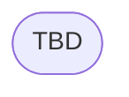

---

## Capabilities

### CAP-REVIEW: User requests changes and agent responds

Reviewers need a structured way to communicate feedback on agent-produced code changes and receive an account of how that feedback was addressed. Burrow provides the data model and tooling to author a Request, dispatch it to an agent, and parse the resulting Response.

---

#### SCN-REQUEST: User creates a request and adds comments

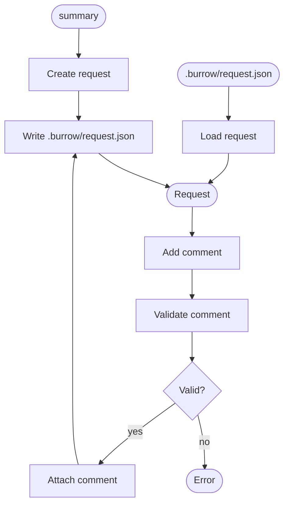

| Node | Slug | Statement | Tags |
|---|---|---|---|
| create_request | `request-id-unique` | SHALL assign a unique identifier to each created Request. | data |
| create_request | `request-created-at` | SHALL record the creation timestamp when a Request is created. | data |
| create_request | `request-repo-root` | SHALL record the working directory at the time of creation as the repo root. | data |
| create_request | `repo-root-git` | SHALL determine the repository root by invoking `git rev-parse --show-toplevel` from the current working directory. | data |
| create_request | `repo-root-noinput` | SHALL exit with `EX_NOINPUT` if the current working directory is not inside a git repository. | error |
| load | `load-session` | SHALL reconstruct a Request from `.burrow/request.json`, preserving all fields and Comments. | data |
| validate | `anchor-file-exists` | SHALL reject a Comment whose file path does not resolve to an existing file within the repo. | data, error |
| validate | `anchor-zero-paired` | SHALL reject a Comment where exactly one of `first_line` or `last_line` is zero. | data, error |
| validate | `anchor-lines-positive` | SHALL reject a Comment where either line number is negative. | data, error |
| validate | `anchor-range-valid` | SHALL reject a Comment whose `first_line` and `last_line` do not form a valid range within the file. | data, error |
| validate | `comment-body-nonempty` | SHALL reject a Comment whose body is empty or consists only of whitespace. | data, error |
| validate | `comment-status-valid` | SHALL reject a Comment whose status is not one of: `todo`, `done`, `partial`, `refused`, `blocked`. | data, error |
| validate | `reply-todo-paired` | SHALL reject a Comment where status is `todo` and reply is present, or where status is not `todo` and reply is absent. | data, error |
| validate | `reply-nonempty` | SHALL reject a Comment whose reply is present but empty or consists only of whitespace. | data, error |
| attach | `comment-id-unique` | SHALL assign a unique identifier to each created Comment. | data |
| write | `write-session` | SHALL write the current Request to `.burrow/request.json` after creation and after each Comment is attached. | data |

---

#### SCN-CLI-START: User initialises a session

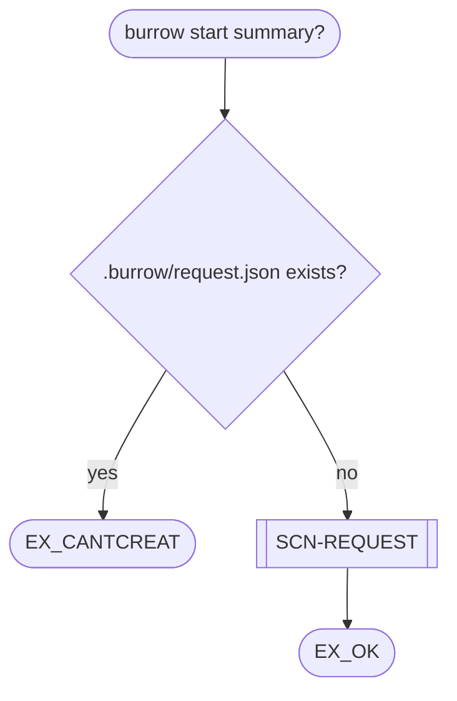

| Node | Slug | Statement | Tags |
|---|---|---|---|
| input | `start-invocation` | SHALL be invoked as `burrow start`. | interface |
| input | `start-summary-optional` | SHALL accept an optional summary argument. | interface |
| exists | `start-excantcreat` | SHALL exit with `EX_CANTCREAT` if `.burrow/request.json` already exists. | error |

---

#### SCN-CLI-ADD: User adds a comment to an existing session

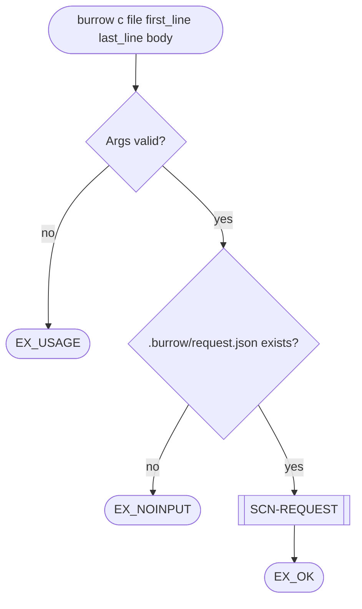

| Node | Slug | Statement | Tags |
|---|---|---|---|
| input | `add-invocation` | SHALL be invoked as `burrow c`. | interface |
| args | `add-usage` | SHALL exit with `EX_USAGE` if any argument is malformed or missing. | error |
| session | `add-noinput` | SHALL exit with `EX_NOINPUT` if no session exists at `.burrow/request.json`. | error |

---

#### SCN-RESPONSE: Agent response is loaded and validated against the current request

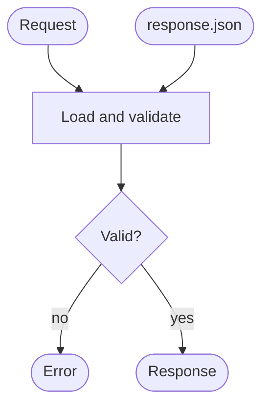

| Node | Slug | Statement | Tags |
|---|---|---|---|
| load | `load-response` | SHALL reconstruct a Response from a JSON file, preserving all fields and Comments. | data |
| load | `response-request-id` | SHALL record the originating Request id on the Response. | data |
| load | `response-created-at` | SHALL record the agent's creation timestamp on the Response. | data |
| load | `response-agent-metadata` | SHALL record agent metadata (at minimum: name and version) on the Response. | data |
| load | `validate-request-id-match` | SHALL reject a Response whose `request_id` does not match the id of the current Request. | data, error |
| load | `validate-all-comments-addressed` | SHALL reject a Response that does not include every Comment from the Request, or in which any Comment has status `todo`. | data, error |
| load | `validate-no-unknown-comments` | SHALL reject a Response that includes a Comment whose id is not present in the Request. | data, error |

---

#### SCN-CLI-VALIDATE: User validates a response against the current session

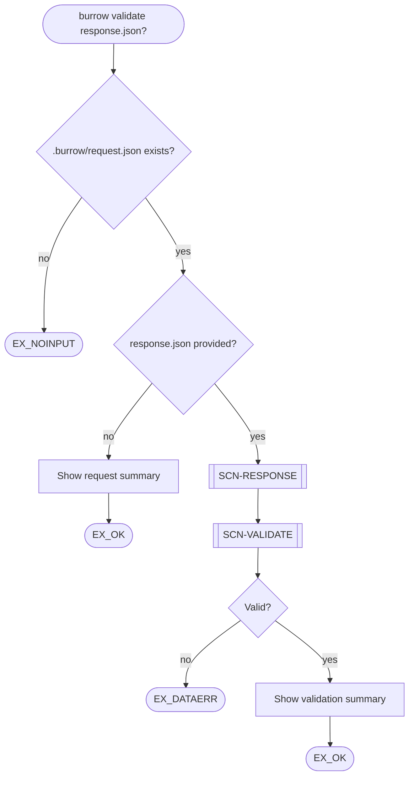

| Node | Slug | Statement | Tags |
|---|---|---|---|
| input | `validate-invocation` | SHALL be invoked as `burrow validate`. | interface |
| input | `validate-response-optional` | SHALL accept an optional path to a response JSON file. | interface |
| session | `validate-noinput` | SHALL exit with `EX_NOINPUT` if no session exists at `.burrow/request.json`, or if a response file path is provided but does not exist. | error |
| validate | `validate-dataerr` | SHALL exit with `EX_DATAERR` if the Response fails validation against the Request. | error |

---

#### SCN-CLI-SEND: User dispatches the current request to an agent

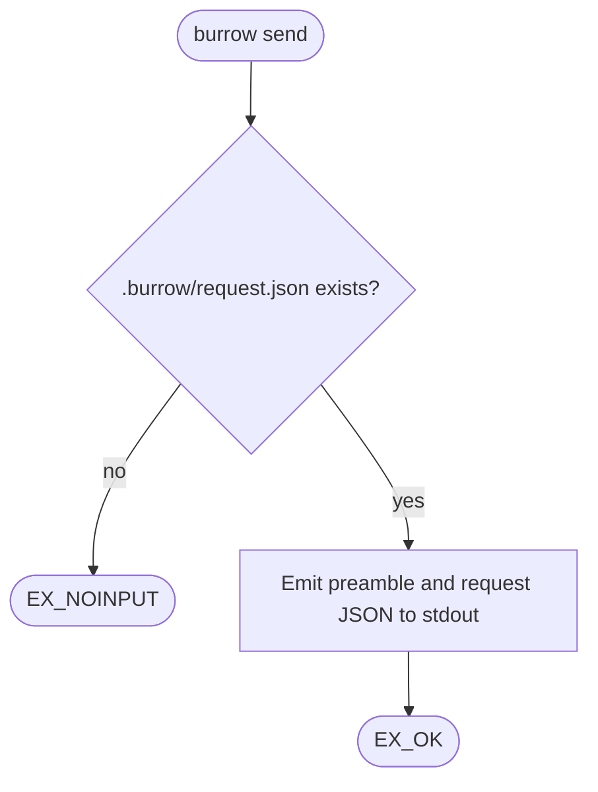

| Node | Slug | Statement | Tags |
|---|---|---|---|
| input | `send-invocation` | SHALL be invoked as `burrow send`. | interface |
| session | `send-noinput` | SHALL exit with `EX_NOINPUT` if no session exists at `.burrow/request.json`. | error |
| emit | `send-stdout` | SHALL write the dispatch preamble followed by the Request JSON to stdout. | interface |

---

#### SCN-CLI-END: User closes the current session

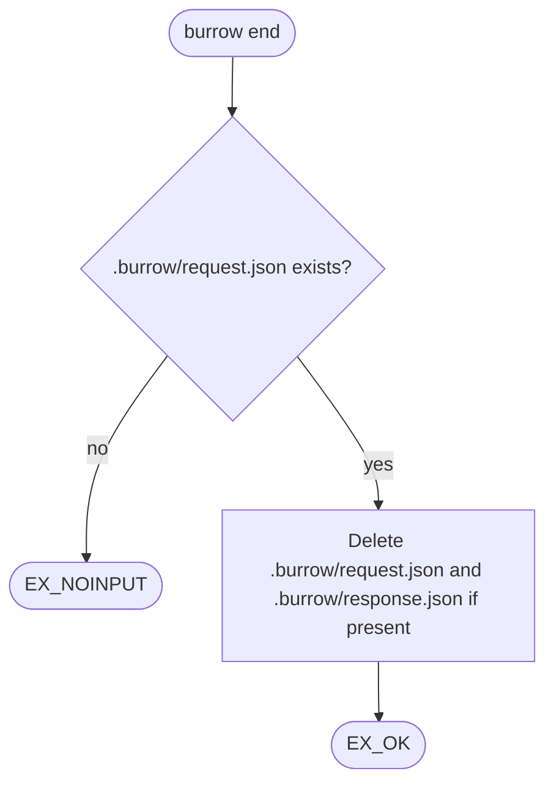

| Node | Slug | Statement | Tags |
|---|---|---|---|
| input | `end-invocation` | SHALL be invoked as `burrow end`. | interface |
| session | `end-noinput` | SHALL exit with `EX_NOINPUT` if no session exists at `.burrow/request.json`. | error |
| delete | `end-deletes-request` | SHALL delete `.burrow/request.json`. | data |
| delete | `end-deletes-response` | SHALL delete `.burrow/response.json` if it exists. | data |

---

### CAP-TUI: Reviewer authors a request interactively

The CLI commands (`burrow c`, `burrow start`) are sufficient for scripted use but are friction-heavy for interactive review. The TUI provides a keyboard-driven interface for browsing uncommitted changes, navigating to any line in any file, authoring comments, and editing the session summary — all without leaving the terminal.

---

#### SCN-TUI-OPEN: User opens the TUI

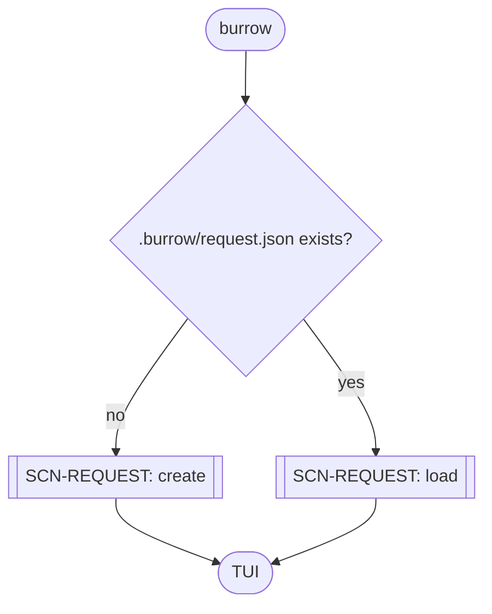

| Node | Slug | Statement | Tags |
|---|---|---|---|
| input | `tui-invocation` | SHALL be invoked as `burrow` with no subcommand. | interface |
| session | `tui-implicit-start` | SHALL create a new session if no session exists, equivalent to `burrow start`. | data |

---

#### SCN-TUI-DIFF: Diff view

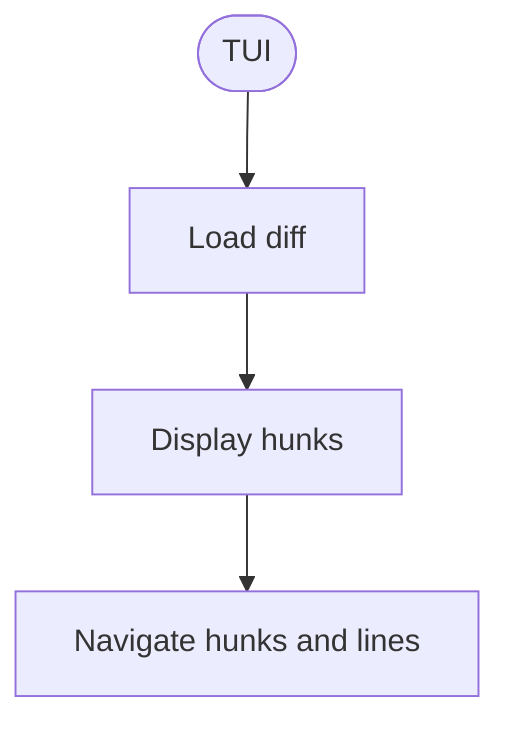

| Node | Slug | Statement | Tags |
|---|---|---|---|
| diff | `diff-source` | SHALL display all uncommitted changes in the repository (staged and unstaged). | data |
| hunks | `diff-hunks` | SHALL display all hunks grouped by file. | interface, usability |
| nav | `diff-nav-next-hunk` | SHALL support navigating to the next hunk. | usability |
| nav | `diff-nav-prev-hunk` | SHALL support navigating to the previous hunk. | usability |
| hunks | `diff-hunk-header` | SHALL display a human-readable header for each hunk showing the filename and target line range. | usability |
| hunks | `diff-line-colour` | SHALL display added lines (prefixed with `+`) and removed lines (prefixed with `-`) each in a distinct colour. | usability |
| nav | `diff-nav-hunk-highlight` | SHALL visually indicate the currently selected hunk. | usability |
| nav | `diff-nav-line` | SHALL support line-by-line navigation within a hunk. | usability |
| nav | `diff-nav-line-scroll` | SHALL scroll the viewport to keep the selected line visible during line navigation. | usability |
| nav | `diff-nav-hunk-clears-line` | SHALL clear the line selection from the previous hunk when navigating to a new hunk. | usability |

---

#### SCN-TUI-FILE: File view

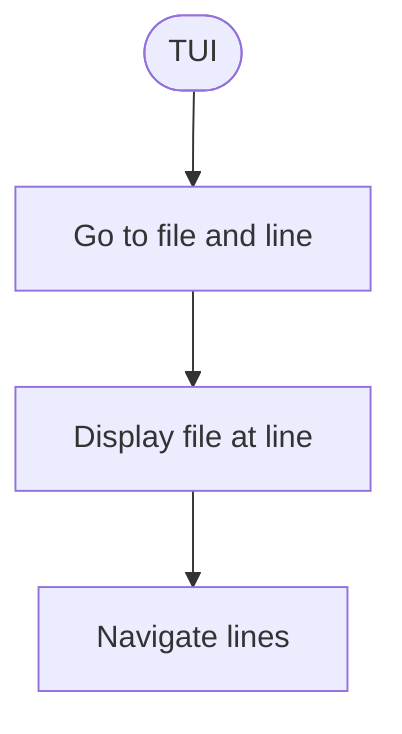

| Node | Slug | Statement | Tags |
|---|---|---|---|
| goto | `file-goto` | SHALL allow the user to navigate to any file and line in the repository, not limited to the diff. | usability |
| file | `file-display` | SHALL display the file with the target line in view. | usability |
| nav | `file-nav-line` | SHALL support line-by-line navigation within the file view. | usability |

---

#### SCN-TUI-COMMENT: User authors a comment

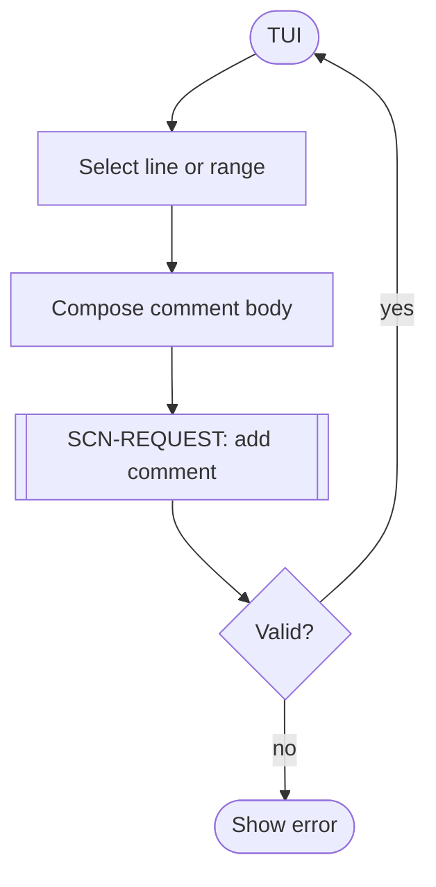

| Node | Slug | Statement | Tags |
|---|---|---|---|
| select | `comment-select-range` | SHALL open the compose input anchored to the current line (single-line) when the user presses `#`, or to the selected range when the user presses `#` in selection mode. | usability |
| select | `comment-select-range-start` | SHALL enter selection mode anchored to the current line when the user presses `v`. | usability |
| select | `comment-select-range-extend` | SHALL extend the selection to the current line as the user navigates with `j`/`k` in selection mode. | usability |
| select | `comment-select-range-highlight` | SHALL visually highlight all lines between the selection anchor and the current line while in selection mode. | usability |
| select | `comment-select-range-cancel` | SHALL exit selection mode without opening the compose input when the user presses `v` again while in selection mode. | usability |
| select | `comment-select-range-cross-hunk` | SHALL discard selection mode if the user navigates to a different hunk. | usability |
| select | `comment-select-any-file` | SHALL allow comments to be anchored to any line in any file, not limited to diff hunks. | usability |
| compose | `comment-compose` | SHALL insert a multiline text input immediately after the last line of the selection in the diff view when the user presses `#`. | usability |
| compose | `comment-compose-submit` | SHALL attach the comment to the session, remove the compose input, and render the comment inline when the user presses `ctrl+enter`. | usability, data |
| compose | `comment-submitted-inline` | SHALL render submitted comments inline in the diff view: the anchored line(s) dimly highlighted, with a comment block immediately below showing the body. | usability |
| compose | `comment-compose-cancel` | SHALL discard the composed comment and remove the input when the user presses `escape`. | usability |
| compose | `comment-compose-expand` | SHALL grow the compose input to fit its content as the user types, with no internal scrollbar. | usability |
| attach | `comment-attach-tui` | SHALL attach the comment to the current session and persist it, equivalent to `burrow c`. | data |
| error | `comment-error-tui` | SHALL display validation errors inline without closing the TUI. | usability, error |

---

#### SCN-TUI-SUMMARY: User edits the session summary

| Node | Slug | Statement | Tags |
|---|---|---|---|
| — | `summary-edit-tui` | SHALL allow the user to edit the session summary at any time during the TUI session. | usability |

---

## Tag Glossary

### Standard tags

| Tag | Meaning |
|---|---|
| `interface` | Exchange of data between components: interchange formats, APIs and protocols. |
| `security` | Authentication, authorisation, data protection, auditing. |
| `data` | Correctness, completeness, validation and storage of data. |
| `error` | Failure modes, warnings, operator messages, recovery. |
| `operational` | Deployment, installation, maintenance, monitoring. |
| `performance` | Throughput, latency, resource usage. |
| `networking` | Network access, protocols, connectivity. |
| `regulatory` | Compliance, risk controls, audit requirements. |
| `configuration` | Behaviour governed by configurable parameters. |
| `usability` | User interface, user experience, accessibility. |

### Project-specific tags

_None defined yet._

---

## Deferred Decisions

| # | Question |
|---|---|
| D-1 | How does Burrow invoke the agent — subprocess, HTTP, stdin/stdout pipe? Burrow will eventually own the dispatch lifecycle; transport mechanism is not yet decided. |
| ~~D-5~~ | ~~Which framework should the TUI be built with?~~ Resolved: Textual. |
| ~~D-2~~ | ~~Does Burrow persist sessions across invocations, or is each run stateless?~~ Resolved: the Request and Response JSON files are the session state. |
| ~~D-3~~ | ~~Is the diff always sourced from git, or can it be provided as a file?~~ Resolved: the agent is assumed to have repo access; the diff is not embedded in the Request. |
| D-4 | SCN-PERSIST is not yet defined. Reading and writing `.burrow/request.json` is currently handled within SCN-REQUEST and should be extracted into a dedicated persistence scenario as the system grows. |
