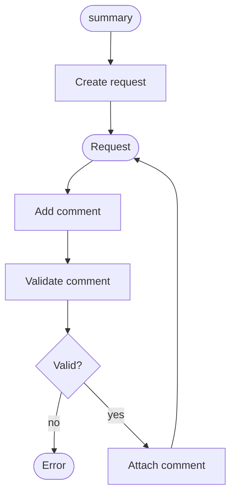

# Burrow — Requirements

Version: 0.0.1
Date: 2026-04-29
Author: SN

---

## Introduction

Burrow is a terminal tool for reviewing code changes produced by coding agents (e.g. Codex, Claude Code). A human reviewer inspects a diff in the terminal, attaches structured comments to specific locations in the diff, and triggers the coding agent to address those comments. Burrow exchanges JSON with the agent: a Request carrying the reviewer's comments goes out, and a Response comes back from the agent.

Burrow is not an agent. It is the interface between a human reviewer and an agent. It does not generate code, interpret comments, or decide how to act on them — that is the agent's responsibility.

---

## Glossary

| Term | Definition |
|---|---|
| Agent | An external coding agent (e.g. Codex, Claude Code) that receives a Request and produces code changes. Burrow treats the agent as a black box. |
| Anchor | A location reference within a file: a tuple of `(file, first_line, last_line)`. A single-line anchor has `first_line == last_line`. A file-level anchor has `first_line == last_line == 0`. An anchor may be updated by the agent in its Response if the referenced code has moved. |
| Comment | A structured annotation authored by the reviewer, carrying an anchor, a markdown body, and a stable id. |
| Diff | A set of file changes that the reviewer is evaluating. The agent is assumed to have access to the diff via the repo. |
| Reply | An agent's response to a single Comment, carrying a status, a body, and optionally a revised anchor. |
| Request | A JSON document sent to the agent containing a unique id, a timestamp, a summary, and the reviewer's list of Comments. |
| Response | A JSON document returned by the agent containing the originating request id, a timestamp, a summary, agent metadata, and a list of Replies. |
| Reviewer | The human operator using Burrow in the terminal to inspect a diff and author Comments. |
| Session | A single review lifecycle: from authoring Comments to dispatching a Request and receiving a Response. |
| Status | The outcome field on a Reply. One of: `done` (agent believes the change was implemented), `partial` (change was partially implemented), `refused` (agent chose not to make the change), `blocked` (agent was unable to make the change). |

---

## Overview

_To be completed once the first capabilities and scenarios are agreed._

---

## Capabilities

### CAP-REVIEW: User requests changes and agent responds

Reviewers need a structured way to communicate feedback on agent-produced code changes and receive an account of how that feedback was addressed. Burrow provides the data model and tooling to author a Request, dispatch it to an agent, and parse the resulting Response.

---

#### SCN-REQUEST: User creates a request and adds comments

| Node | Slug | Statement | Tags |
|---|---|---|---|
| create_request | `request-id-unique` | SHALL assign a unique identifier to each created request. | data |
| create_request | `request-created-at` | SHALL record the creation timestamp when a request is created. | data |
| validate | `anchor-file-exists` | SHALL reject a comment whose file path does not resolve to an existing file within the repo. | data, error |
| validate | `anchor-zero-paired` | SHALL reject a comment where exactly one of `first_line` or `last_line` is zero. | data, error |
| validate | `anchor-lines-positive` | SHALL reject a comment where either line number is negative. | data, error |
| validate | `anchor-range-valid` | SHALL reject a comment whose `first_line` and `last_line` do not form a valid range within the file. | data, error |
| validate | `comment-body-nonempty` | SHALL reject a comment whose body is empty or consists only of whitespace. | data, error |
| attach | `comment-id-unique` | SHALL assign a unique identifier to each created comment. | data |

---

## Tag Glossary

### Standard tags

| Tag | Meaning |
|---|---|
| `interface` | Exchange of data between components: interchange formats, APIs and protocols. |
| `security` | Authentication, authorisation, data protection, auditing. |
| `data` | Correctness, completeness, validation and storage of data. |
| `error` | Failure modes, warnings, operator messages, recovery. |
| `operational` | Deployment, installation, maintenance, monitoring. |
| `performance` | Throughput, latency, resource usage. |
| `networking` | Network access, protocols, connectivity. |
| `regulatory` | Compliance, risk controls, audit requirements. |
| `configuration` | Behaviour governed by configurable parameters. |
| `usability` | User interface, user experience, accessibility. |

### Project-specific tags

_None defined yet._

---

## Deferred Decisions

| # | Question |
|---|---|
| D-1 | How does Burrow invoke the agent — subprocess, HTTP, stdin/stdout pipe? Burrow will eventually own the dispatch lifecycle; transport mechanism is not yet decided. |
| ~~D-2~~ | ~~Does Burrow persist sessions across invocations, or is each run stateless?~~ Resolved: the Request and Response JSON files are the session state. |
| ~~D-3~~ | ~~Is the diff always sourced from git, or can it be provided as a file?~~ Resolved: the agent is assumed to have repo access; the diff is not embedded in the Request. |
